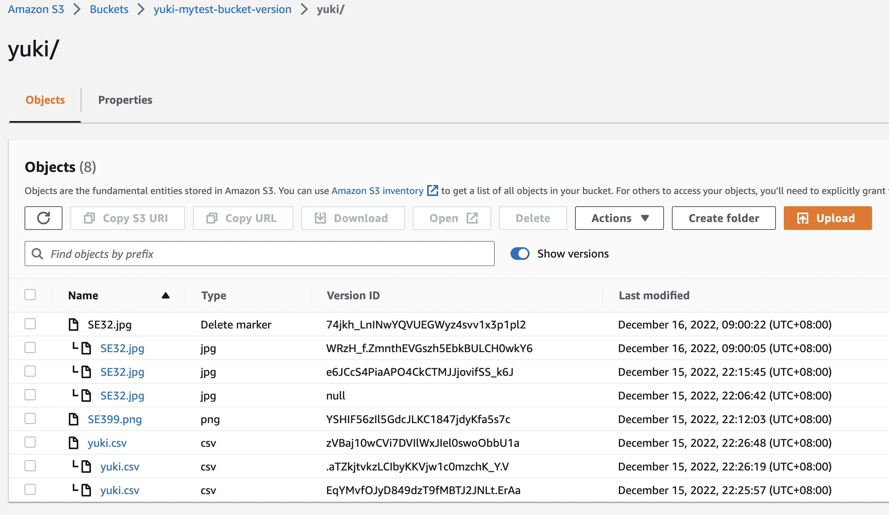

<!--ts-->
* [S3 Demo](#s3-demo)
   * [<a href="https://docs.aws.amazon.com/AmazonS3/latest/userguide/Welcome.html" rel="nofollow">What is Amazon S3</a>](#what-is-amazon-s3)
   * [<a href="https://s3.console.aws.amazon.com/s3/buckets?region=us-east-1" rel="nofollow">How to use amazon s3</a>](#how-to-use-amazon-s3)
      * [Register Account](#register-account)
* [Use S3](#use-s3)
   * [Create Bucket](#create-bucket)
   * [Permission settings](#permission-settings)
   * [s3 struct](#s3-struct)
* [<a href="https://docs.aws.amazon.com/zh_cn/AmazonS3/latest/userguide/UsingAWSSDK.html#sdk-general-information-section" rel="nofollow">AWS SDK for Go</a>](#aws-sdk-for-go)
   * [<a href="https://aws.github.io/aws-sdk-go-v2/docs/getting-started/" rel="nofollow">AWS SDK for go getting-started</a>](#aws-sdk-for-go-getting-started)
      * [<a href="examples/example01_hello/main.go">HelloWorld Hello S3</a>](#helloworld-hello-s3)
   * [go code](#go-code)
      * [Init Sdk](#init-sdk)
      * [<a href="examples/example02_bucket/bucket_test.go">Bucket Example</a>](#bucket-example)
         * [create](#create)
         * [QueryList](#querylist)
         * [IsExists](#isexists)
         * [delete](#delete)
      * [<a href="examples/example03_object/object_test.go">Object Example</a>](#object-example)
         * [Upload and Download](#upload-and-download)
         * [QueryList](#querylist-1)
         * [QueryInfo](#queryinfo)
         * [Delete](#delete-1)
      * [Permission](#permission)
         * [Bucket](#bucket)
         * [Object](#object)
      * [Object Version Control](#object-version-control)
      * [Enabled version control](#enabled-version-control)
   * [S3 Pricing](#s3-pricing)
   * [What Else?](#what-else)

<!-- Created by https://github.com/ekalinin/github-markdown-toc -->
<!-- Added by: runner, at: Fri Dec 16 02:35:49 UTC 2022 -->

<!--te-->

# S3 Demo

## [What is Amazon S3](https://docs.aws.amazon.com/AmazonS3/latest/userguide/Welcome.html)
It is a file service that can store png, jpg, csv, html and other files. Saved and publicly accessible

## [How to use amazon s3](https://s3.console.aws.amazon.com/s3/buckets?region=us-east-1)

### Register Account
First, you must register an aws account, which requires a visa card to register. After registration, you can enjoy the 5G space of s3, which can be used for free for 12 months.


# Use S3

## Create Bucket
Normal creation, all go through the default process, and finally access the image address, there will be such a prompt, this kind of problem is that the obejct permission is not enabled


## Permission settings
There are three places where permissions need to be set
- object ownership (ACL)，When creating a bucket, you need to enable it. It is used to control the permission of the object. If it is not activated, the object permission column will be gray.


- block public access setting, It is used to prevent others from accessing your object. If checked, will block everyone except you


- Access control list (ACL)，If the bucket ACL is not set, it will be grayed out and cannot be set. If the ACL is enabled, it can be set for others to access.


- After setting, visit again, you can see the file


## S3 Struct

It is a globally uniquely named bucket, and its structure is as follows


# [AWS SDK for Go](https://docs.aws.amazon.com/zh_cn/AmazonS3/latest/userguide/UsingAWSSDK.html#sdk-general-information-section)
You can read the source code of aws sdk for go here, and browse the aws provided by[code example](https://docs.aws.amazon.com/zh_cn/AmazonS3/latest/userguide/service_code_examples.html)

## [AWS SDK for go getting-started](https://aws.github.io/aws-sdk-go-v2/docs/getting-started/)

First, you have to register an AWS account, and then get the Keys of the account.


Create Access Key


After setting, you can get Keys. With the keys, you need to set up the key environment of the machine, and I use aws cli to set it here.
1. Install aws cli in mac
```bash
$ curl "https://awscli.amazonaws.com/AWSCLIV2.pkg" -o "AWSCLIV2.pkg"
$ sudo installer -pkg AWSCLIV2.pkg -target /

$ which aws
$ aws --version
```

2. Set Key
```bash
$ aws configure       
AWS Access Key ID : xxx
AWS Secret Access Key : xxx
Default region name [None]: us-west-2
Default output format [None]: json

$ ls -al ~/.aws/
total 16
drwxr-xr-x   4 yy  staff   128 12 15 00:10 .
drwxr-x---+ 50 yy  staff  1600 12 15 00:11 ..
-rw-------   1 yy  staff    43 12 15 00:10 config
-rw-------   1 yy  staff   116 12 15 00:09 credentials
```

3. Check whether the setting is successful
```zsh
$ aws s3 ls
2022-12-14 22:48:01 yuki-mytest-bucket
```

### [HelloWorld Hello S3](examples/example01_hello/main.go)
```go
package main

import (
	"context"
	"log"

	"github.com/aws/aws-sdk-go-v2/config"
	"github.com/aws/aws-sdk-go-v2/service/s3"
)

func main() {
	sdkConfig, err := config.LoadDefaultConfig(context.TODO())
	if err != nil {
		log.Fatalf("not found account key: %v", err)
	}
	s3Client := s3.NewFromConfig(sdkConfig)

	buckets, err := s3Client.ListBuckets(context.TODO(), nil)
	if err != nil {
		log.Fatalf("get bucket list err: %v", err)
	}

	for _, bucket := range buckets.Buckets {
		log.Printf("\t%v\n", *bucket.Name)
	}
}
```

```output
$ go run main.go 
Let's list up to 10 buckets for your account.
        yuki-mytest-bucket
```

## Go Code
### Init Sdk
```go
type BucketBasics struct {
	S3Client *s3.Client
}

func NewS3Client() *BucketBasics {
	sdkConfig, err := config.LoadDefaultConfig(context.TODO())
	if err != nil {
		log.Fatalf("Couldn't load default configuration. Have you set up your AWS account?, err: %v", err)
	}

	s3Client := s3.NewFromConfig(sdkConfig)
	return &BucketBasics{S3Client: s3Client}
}
```

### [Bucket Example](examples/example02_bucket/bucket_test.go)
>#### Create
```go
func (basics BucketBasics) CreateBucket(name string, region string) error {
	_, err := basics.S3Client.CreateBucket(context.TODO(), &s3.CreateBucketInput{
		Bucket: aws.String(name),
		CreateBucketConfiguration: &types.CreateBucketConfiguration{
			LocationConstraint: types.BucketLocationConstraint(region),
		},
	})
	if err != nil {
		log.Printf("Couldn't create bucket %v in Region %v. Here's why: %v\n",
			name, region, err)
	}
	return err
}
```

>#### QueryList
```go
func (s *S3Base) GetBucketList() ([]types.Bucket, error) {
	result, err := s.S3Client.ListBuckets(context.TODO(), &s3.ListBucketsInput{})
	var buckets []types.Bucket
	if err != nil {
		log.Printf("Couldn't list buckets for your account. Here's why: %v\n", err)
	} else {
		buckets = result.Buckets
	}
	return buckets, err
}
```

>#### IsExists
```go
func (s *S3Base) BucketExists(bucketName string) (bool, error) {
	_, err := s.S3Client.HeadBucket(context.TODO(), &s3.HeadBucketInput{
		Bucket: aws.String(bucketName),
	})
	exists := true
	if err != nil {
		var apiError smithy.APIError
		if errors.As(err, &apiError) {
			switch apiError.(type) {
			case *types.NotFound:
				log.Printf("Bucket %v is available.\n", bucketName)
				exists = false
				err = nil
			default:
				log.Printf("Either you don't have access to bucket %v or another error occurred. "+
					"Here's what happened: %v\n", bucketName, err)
			}
		}
	} else {
		log.Printf("Bucket %v exists and you already own it.", bucketName)
	}

	return exists, err
}

```

>#### Delete
```go
func (s *S3Base) DeleteBucket(bucketName string) error {
	_, err := s.S3Client.DeleteBucket(context.TODO(), &s3.DeleteBucketInput{
		Bucket: aws.String(bucketName)})
	if err != nil {
		log.Printf("Couldn't delete bucket %v. Here's why: %v\n", bucketName, err)
	}
	return err
}
```


### [Object Example](examples/example03_object/object_test.go)
>#### Upload and Download
```go
func (s *S3Base) UploadFile(bucketName string, objectKey string, fileName string) error {
	file, err := os.Open(fileName)
	if err != nil {
		log.Printf("Couldn't open file %v to upload. Here's why: %v\n", fileName, err)
	} else {
		defer func(file *os.File) {
			err := file.Close()
			if err != nil {
				log.Fatalf("file close err: %v", err)
			}
		}(file)

		_, err := s.S3Client.PutObject(context.TODO(), &s3.PutObjectInput{
			Bucket: aws.String(bucketName),
			Key:    aws.String(objectKey),
			Body:   file,
		})
		if err != nil {
			log.Printf("Couldn't upload file %v to %v:%v. Here's why: %v\n",
				fileName, bucketName, objectKey, err)
		}
	}
	return err
}

func (s *S3Base) UploadLargeObject(bucketName string, objectKey string, largeObject []byte) error {
	largeBuffer := bytes.NewReader(largeObject)
	var partMiBs int64 = 10
	uploader := manager.NewUploader(s.S3Client, func(u *manager.Uploader) {
		u.PartSize = partMiBs * 1024 * 1024
	})
	_, err := uploader.Upload(context.TODO(), &s3.PutObjectInput{
		Bucket: aws.String(bucketName),
		Key:    aws.String(objectKey),
		Body:   largeBuffer,
	})
	if err != nil {
		log.Printf("Couldn't upload large object to %v:%v. Here's why: %v\n",
			bucketName, objectKey, err)
	}

	return err
}

func (s *S3Base) DownloadFile(bucketName string, objectKey string, fileName string) error {
	result, err := s.S3Client.GetObject(context.TODO(), &s3.GetObjectInput{
		Bucket: aws.String(bucketName),
		Key:    aws.String(objectKey),
	})
	if err != nil {
		log.Printf("Couldn't get object %v:%v. Here's why: %v\n", bucketName, objectKey, err)
		return err
	}
	defer func(Body io.ReadCloser) {
		err := Body.Close()
		if err != nil {
			log.Fatalf("body close err: %v", err)
		}
	}(result.Body)
	file, err := os.Create(fileName)
	if err != nil {
		log.Printf("Couldn't create file %v. Here's why: %v\n", fileName, err)
		return err
	}

	defer func(file *os.File) {
		err := file.Close()
		if err != nil {
			log.Fatalf("file close err: %v", err)
		}
	}(file)

	body, err := io.ReadAll(result.Body)
	if err != nil {
		log.Printf("Couldn't read object body from %v. Here's why: %v\n", objectKey, err)
	}
	_, err = file.Write(body)
	return err
}

func (s *S3Base) DownloadLargeObject(bucketName string, objectKey string) ([]byte, error) {
	var partMiBs int64 = 10
	downloader := manager.NewDownloader(s.S3Client, func(d *manager.Downloader) {
		d.PartSize = partMiBs * 1024 * 1024
	})
	buffer := manager.NewWriteAtBuffer([]byte{})
	_, err := downloader.Download(context.TODO(), buffer, &s3.GetObjectInput{
		Bucket: aws.String(bucketName),
		Key:    aws.String(objectKey),
	})
	if err != nil {
		log.Printf("Couldn't download large object from %v:%v. Here's why: %v\n",
			bucketName, objectKey, err)
	}
	return buffer.Bytes(), err
}
```

>#### QueryList
```go
func (s *S3Base) GetObjectList(bucketName string) ([]types.Object, error) {
	result, err := s.S3Client.ListObjectsV2(context.TODO(), &s3.ListObjectsV2Input{
		Bucket: aws.String(bucketName),
	})
	var contents []types.Object
	if err != nil {
		log.Printf("Couldn't list objects in bucket %v. Here's why: %v\n", bucketName, err)
	} else {
		contents = result.Contents
	}
	return contents, err
}
```

>#### QueryInfo
```go
func (s *S3Base) GetObjectContent(bucketName, key string) (string, error) {
	output, err := s.S3Client.GetObject(context.TODO(), &s3.GetObjectInput{
		Bucket: &bucketName,
		Key:    &key,
	})
	if err != nil {
		return "", err
	}
	buf := new(bytes.Buffer)
	buf.ReadFrom(output.Body)
	return buf.String(), err
}

func (s *S3Base) GetObjectUrl(bucketName, Key string) (string, error) {
	input := &s3.GetObjectInput{
		Bucket: aws.String(bucketName),
		Key:    aws.String(Key),
	}
	psClient := s3.NewPresignClient(s.S3Client)
	resp, err := psClient.PresignGetObject(context.TODO(), input)
	if err != nil {
		return "", err
	}
	return resp.URL, err
}

func (s *S3Base) GetObjectList(bucketName string) ([]types.Object, error) {
	result, err := s.S3Client.ListObjectsV2(context.TODO(), &s3.ListObjectsV2Input{
		Bucket: aws.String(bucketName),
	})
	var contents []types.Object
	if err != nil {
		log.Printf("Couldn't list objects in bucket %v. Here's why: %v\n", bucketName, err)
	} else {
		contents = result.Contents
	}
	return contents, err
}
```

>#### Delete
```go
func (s *S3Base) DeleteObject(bucketName string, object types.Object) error {
	_, err := s.S3Client.DeleteObject(context.TODO(), &s3.DeleteObjectInput{
		Bucket: &bucketName,
		Key:    object.Key,
	})
	if err != nil {
		log.Printf("Couldn't delete objects %v from bucket %v. Here's why: %v\n", object.Key, bucketName, err)
	}
	return err
}

func (s *S3Base) DeleteObjectList(bucketName string, objectList []types.Object) error {
	var objectIds []types.ObjectIdentifier
	for _, obj := range objectList {
		objectIds = append(objectIds, types.ObjectIdentifier{Key: aws.String(*obj.Key)})
	}
	_, err := s.S3Client.DeleteObjects(context.TODO(), &s3.DeleteObjectsInput{
		Bucket: aws.String(bucketName),
		Delete: &types.Delete{Objects: objectIds},
	})
	if err != nil {
		log.Printf("Couldn't delete objects from bucket %v. Here's why: %v\n", bucketName, err)
	}
	return err
}

func (s *S3Base) DeleteObjectListByKeys(bucketName string, objectKeys []string) error {
	var objectIds []types.ObjectIdentifier
	for _, key := range objectKeys {
		objectIds = append(objectIds, types.ObjectIdentifier{Key: aws.String(key)})
	}
	_, err := s.S3Client.DeleteObjects(context.TODO(), &s3.DeleteObjectsInput{
		Bucket: aws.String(bucketName),
		Delete: &types.Delete{Objects: objectIds},
	})
	if err != nil {
		log.Printf("Couldn't delete objects from bucket %v. Here's why: %v\n", bucketName, err)
	}
	return err
}
```

### [Permission](examples/example04_permission/premission_test.go)
>#### Bucket
```go
func (s *S3Base) CreatePublicBucket(bucketName, region string) error {
	input := &s3.CreateBucketInput{
		Bucket: aws.String(bucketName),
		ACL:    types.BucketCannedACLPublicReadWrite,
		CreateBucketConfiguration: &types.CreateBucketConfiguration{
			LocationConstraint: types.BucketLocationConstraint(region),
		},
	}
	_, err := s.S3Client.CreateBucket(context.TODO(), input)
	if err != nil {
		return err
	}
	return nil
}

func (s *S3Base) PutPublicBucketAcl(bucketName string) error {
	putInput := &s3.PutBucketAclInput{
		Bucket: aws.String(bucketName),
		ACL:    types.BucketCannedACLPublicReadWrite,
	}
	_, err := s.S3Client.PutBucketVersioning(context.TODO(), putInput)
	if err != nil {
		return err
	}
	return nil
}
```

>#### Object
```go
func (s *S3Base) UploadPublicFileAcl(bucketName, objectKey, fileName string) error {
	file, err := os.Open(fileName)
	if err != nil {
		log.Printf("Couldn't open file %v to upload. Here's why: %v\n", fileName, err)
	} else {
		defer func(file *os.File) {
			err := file.Close()
			if err != nil {
				log.Fatalf("file close err: %v", err)
			}
		}(file)

		_, err := s.S3Client.PutObject(context.TODO(), &s3.PutObjectInput{
			Bucket: aws.String(bucketName),
			Key:    aws.String(objectKey),
			Body:   file,
			ACL:    types.ObjectCannedACLPublicReadWrite,
		})
		if err != nil {
			log.Printf("Couldn't upload file %v to %v:%v. Here's why: %v\n",
				fileName, bucketName, objectKey, err)
		}
	}
	return err
}

func (s *S3Base) PutPublicObjectAcl(bucketName, objectKey string) error {
	input := &s3.PutObjectAclInput{
		Bucket: aws.String(bucketName),
		Key:    aws.String(objectKey),
		ACL:    types.ObjectCannedACLPublicReadWrite,
	}

	_, err := s.S3Client.PutObjectAcl(context.TODO(), input)
	if err != nil {
		return err
	}
	return nil
}

```

### Object Version Control
Version control, as its name suggests, uses version control to control it. Its advantage is that when deleting an object, it is not physically deleted, but a mark is placed on the deletion. Therefore, if the file is deleted by an operation other than the user, it can be restored through version control.

If the user is overwriting this object, it is actually creating a new version of this object.

Bucket version status
1. Unversioned (default)
2. Enabled version control (note: once enabled, it cannot be restored)
3. Suspend version control

### [Enabled version control](examples/example05_version/version_test.go)

It can be seen that after the version control is started, there is an additional version display (hidden) button. After clicking, you can see the version. The nil version is a previously uploaded image, so it has no version. After enabling version control, s3 will add a 32-bit version number to it



0. Set You need to create a bucket before setting it up
```go
func (s *S3Base) CreateBucketAndEnabledVersion(bucketName, region string) error {
	err := s.CreatePublicBucket(bucketName, region)
	if err != nil {
		return err
	}

	putInput := &s3.PutBucketVersioningInput{
		Bucket: &bucketName,
		VersioningConfiguration: &types.VersioningConfiguration{
			Status: types.BucketVersioningStatusEnabled,
		},
	}
	_, err = s.S3Client.PutBucketVersioning(context.TODO(), putInput)
	if err != nil {
		return err
	}
	return nil
}
```
>#### Add
```go
s3Action.UploadFile(bucket, filename, key)
```
>#### Recover
```go
func (s *S3Base) GetObjectVersionList(bucketName string) ([]types.ObjectVersion, error) {
	input := &s3.ListObjectVersionsInput{
		Bucket: aws.String(bucketName),
	}
	versions, err := s.S3Client.ListObjectVersions(context.TODO(), input)
	if err != nil {
		return nil, err
	}
	return versions.Versions, nil
}

func (s *S3Base) GetObjectByVersion(bucketName, objectKey, versionId string) (string, error) {
	input := &s3.GetObjectInput{
		Bucket:    &bucketName,
		Key:       &objectKey,
		VersionId: &versionId,
	}
	output, err := s.S3Client.GetObject(context.TODO(), input)
	if err != nil {
		return "", err
	}

	buf := new(bytes.Buffer)
	_, err = buf.ReadFrom(output.Body)
	if err != nil {
		return "", err
	}
	return buf.String(), err
}
```
>#### Del
```go
func (s *S3Base) DeleteObjectByVersion(bucketName, objectKey, versionId string) error {
	input := &s3.DeleteObjectInput{
		Bucket:    aws.String(bucketName),
		Key:       aws.String(objectKey),
		VersionId: aws.String(versionId),
	}
	_, err := s.S3Client.DeleteObject(context.TODO(), input)
	if err != nil {
		return err
	}
	return nil
}
```


## S3 Pricing
[Price Details](https://aws.amazon.com/s3/pricing/)
[Price calculator](https://calculator.aws/#/addService)
1. Storage
	- First 50TB/month -> 0.023$/GB
	- After 450TB/month -> 0.022$/GB
	- Over 500TB/month -> 0.021$/GB
2. Requests
	- 1000/req -> 0.005$
3. Transfer
	- TransferIn aws -> free
	- aws TransferOut internet First 10TB/month -> 0.09$/GB
	- aws TransferOut internet Next 40TB/month -> 0.85$/GB
	- aws TransferOut internet After 100TB/month -> 0.07$/GB
	- aws TransferOut internet Over 150TB/month -> 0.05$/GB
4. Management
	- Store millions of objects -> 0.0025$
	- Monitor millions of objects -> 0.1$
	- Mark 10,000 objects -> 0.01$
5. Replication
	- Replication millions of objects -> 1$
6. lambda
	- s/GB -> 0.0000167$
	- M/req -> 0.2$

## What Else?
- [x] [Extract text from images](https://docs.aws.amazon.com/zh_cn/AmazonS3/latest/userguide/example_cross_TextractComprehendDetectEntities_section.html)
- [x] [Extract faces from images](https://docs.aws.amazon.com/zh_cn/AmazonS3/latest/userguide/example_cross_DetectFaces_section.html)
- [x] [Extract objects from pictures](https://docs.aws.amazon.com/zh_cn/AmazonS3/latest/userguide/example_cross_RekognitionPhotoAnalyzer_section.html)
- [x] [Extract people from video](https://docs.aws.amazon.com/zh_cn/AmazonS3/latest/userguide/example_cross_RekognitionVideoDetection_section.html)
- [x] [Convert text to speech](https://docs.aws.amazon.com/zh_cn/AmazonS3/latest/userguide/example_cross_Telephone_section.html)