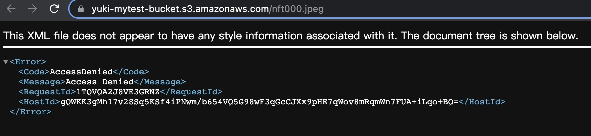
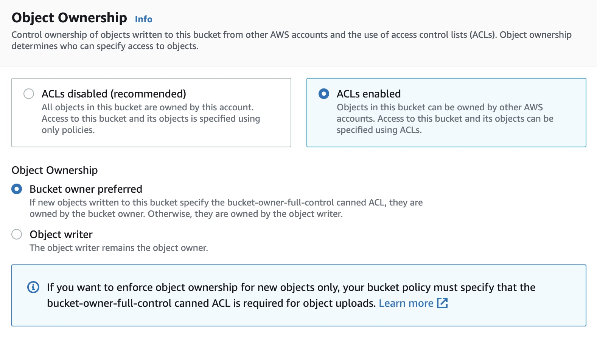
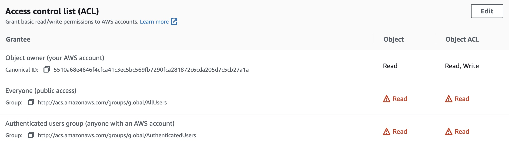
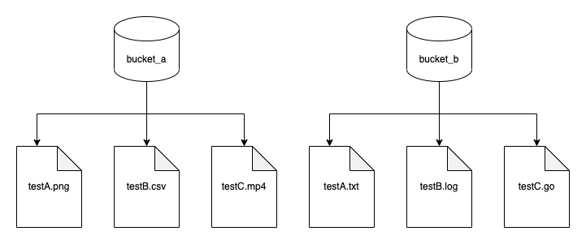

# s3 demo

## [What is Amazon S3](https://docs.aws.amazon.com/AmazonS3/latest/userguide/Welcome.html)
它是一种文件服务，上面可以存储png, jpg, csv, html等一些文件。存上去了，可以公开访问

## [怎么使用 amazon s3](https://s3.console.aws.amazon.com/s3/buckets?region=us-east-1)

### 注册账户
首先得先注册一个 aws 账户，它需要 visa 卡， 才能进行注册。注册后，可以享受 s3 的 5G 空间，可以使用12个月。


### 进入 s3


### 创建 bucket
正常创建，全部走默认流程，最终访问图片地址，会出现这样的提示，这种问题是没有打开obejct权限



### 权限设置
有三个地方需要设置权限
- object ownership (ACL)，在创建 bucket 时，需要设置启动它，它是用来控制 object 的权限的，如果未启动，object 权限栏，将会是灰色的。


- block public access setting，它是用来阻止别人来访问你的object的。如果勾选的，将会阻止除了你以外的所有人


- Access control list (ACL)，如果未设置 bucket ACL，这里将会是灰色的，不能设置，启动了ACL，就可以设置让其他人访问了。


- 设置后，再次访问，就可以看到文件了


## s3 架构

它是以一个全球唯一命名 bucket， 它的结构如下




## [AWS SDK for Go](https://docs.aws.amazon.com/zh_cn/AmazonS3/latest/userguide/UsingAWSSDK.html#sdk-general-information-section)
可以在这里阅读 aws sdk for go 的源码，可以在浏览 aws 提供的[代码示例](https://docs.aws.amazon.com/zh_cn/AmazonS3/latest/userguide/service_code_examples.html)

### [AWS SDK for go getting-started](https://aws.github.io/aws-sdk-go-v2/docs/getting-started/)

首先得注册AWS账户，然后拿到账户的 Account Keys，


Create Access Key


设置好了，可以拿到Keys。有了keys，需要设置本机的密钥环境，我这边时用 aws cli 来设置的。
1. mac 下安装 aws cli
```bash
$ curl "https://awscli.amazonaws.com/AWSCLIV2.pkg" -o "AWSCLIV2.pkg"
$ sudo installer -pkg AWSCLIV2.pkg -target /

$ which aws
$ aws --version
```

2. 设置密钥
```bash
$ aws configure       
AWS Access Key ID : xxx
AWS Secret Access Key : xxx
Default region name [None]: us-west-2
Default output format [None]: json

$ ls -al ~/.aws/
total 16
drwxr-xr-x   4 yy  staff   128 12 15 00:10 .
drwxr-x---+ 50 yy  staff  1600 12 15 00:11 ..
-rw-------   1 yy  staff    43 12 15 00:10 config
-rw-------   1 yy  staff   116 12 15 00:09 credentials
```

3. 检查是否设置成功
```zsh
$ aws s3 ls
2022-12-14 22:48:01 yuki-mytest-bucket
```

### [HelloWorld Hello S3](examples/example01_hello/main.go)
```go
// Copyright Amazon.com, Inc. or its affiliates. All Rights Reserved.
// SPDX-License-Identifier: Apache-2.0

// snippet-start:[gov2.s3.Hello]

package main

import (
	"context"
	"fmt"

	"github.com/aws/aws-sdk-go-v2/config"
	"github.com/aws/aws-sdk-go-v2/service/s3"
)

// main uses the AWS SDK for Go V2 to create an Amazon Simple Storage Service
// (Amazon S3) client and list up to 10 buckets in your account.
// This example uses the default settings specified in your shared credentials
// and config files.
func main() {
	sdkConfig, err := config.LoadDefaultConfig(context.TODO())
	if err != nil {
		fmt.Println("Couldn't load default configuration. Have you set up your AWS account?")
		fmt.Println(err)
		return
	}
	s3Client := s3.NewFromConfig(sdkConfig)
	count := 10
	fmt.Printf("Let's list up to %v buckets for your account.\n", count)
	result, err := s3Client.ListBuckets(context.TODO(), &s3.ListBucketsInput{})
	if err != nil {
		fmt.Printf("Couldn't list buckets for your account. Here's why: %v\n", err)
		return
	}
	if len(result.Buckets) == 0 {
		fmt.Println("You don't have any buckets!")
	} else {
		if count > len(result.Buckets) {
			count = len(result.Buckets)
		}
		for _, bucket := range result.Buckets[:count] {
			fmt.Printf("\t%v\n", *bucket.Name)
		}
	}
}

// snippet-end:[gov2.s3.Hello]
```

```output
$ go run main.go 
Let's list up to 10 buckets for your account.
        yuki-mytest-bucket
```

## go code
### init sdk
```go
type BucketBasics struct {
	S3Client *s3.Client
}

func NewS3Client() *BucketBasics {
	sdkConfig, err := config.LoadDefaultConfig(context.TODO())
	if err != nil {
		log.Fatalf("Couldn't load default configuration. Have you set up your AWS account?, err: %v", err)
	}

	s3Client := s3.NewFromConfig(sdkConfig)
	return &BucketBasics{S3Client: s3Client}
}
```

### bucket
#### create
```go
func (basics BucketBasics) CreateBucket(name string, region string) error {
	_, err := basics.S3Client.CreateBucket(context.TODO(), &s3.CreateBucketInput{
		Bucket: aws.String(name),
		CreateBucketConfiguration: &types.CreateBucketConfiguration{
			LocationConstraint: types.BucketLocationConstraint(region),
		},
	})
	if err != nil {
		log.Printf("Couldn't create bucket %v in Region %v. Here's why: %v\n",
			name, region, err)
	}
	return err
}
```

#### query
```go
func (basics BucketBasics) ListBuckets() ([]types.Bucket, error) {
	result, err := basics.S3Client.ListBuckets(context.TODO(), &s3.ListBucketsInput{})
	var buckets []types.Bucket
	if err != nil {
		log.Printf("Couldn't list buckets for your account. Here's why: %v\n", err)
	} else {
		buckets = result.Buckets
	}
	return buckets, err
}
```

#### IsExists
```go
func (basics BucketBasics) BucketExists(bucketName string) (bool, error) {
	_, err := basics.S3Client.HeadBucket(context.TODO(), &s3.HeadBucketInput{
		Bucket: aws.String(bucketName),
	})
	exists := true
	if err != nil {
		var apiError smithy.APIError
		if errors.As(err, &apiError) {
			switch apiError.(type) {
			case *types.NotFound:
				log.Printf("Bucket %v is available.\n", bucketName)
				exists = false
				err = nil
			default:
				log.Printf("Either you don't have access to bucket %v or another error occurred. "+
					"Here's what happened: %v\n", bucketName, err)
			}
		}
	} else {
		log.Printf("Bucket %v exists and you already own it.", bucketName)
	}

	return exists, err
}
```

#### delete
```go
func (basics BucketBasics) DeleteBucket(bucketName string) error {
	_, err := basics.S3Client.DeleteBucket(context.TODO(), &s3.DeleteBucketInput{
		Bucket: aws.String(bucketName)})
	if err != nil {
		log.Printf("Couldn't delete bucket %v. Here's why: %v\n", bucketName, err)
	}
	return err
}
```


### object
#### upload
```go
func (basics BucketBasics) UploadFile(bucketName string, objectKey string, fileName string) error {
	file, err := os.Open(fileName)
	if err != nil {
		log.Printf("Couldn't open file %v to upload. Here's why: %v\n", fileName, err)
	} else {
		defer func(file *os.File) {
			err := file.Close()
			if err != nil {
				log.Fatalf("file close err: %v", err)
			}
		}(file)

		_, err := basics.S3Client.PutObject(context.TODO(), &s3.PutObjectInput{
			Bucket: aws.String(bucketName),
			Key:    aws.String(objectKey),
			Body:   file,
		})
		if err != nil {
			log.Printf("Couldn't upload file %v to %v:%v. Here's why: %v\n",
				fileName, bucketName, objectKey, err)
		}
	}
	return err
}
```

#### queryList
```go
func (basics BucketBasics) ListObjects(bucketName string) ([]types.Object, error) {
	result, err := basics.S3Client.ListObjectsV2(context.TODO(), &s3.ListObjectsV2Input{
		Bucket: aws.String(bucketName),
	})
	var contents []types.Object
	if err != nil {
		log.Printf("Couldn't list objects in bucket %v. Here's why: %v\n", bucketName, err)
	} else {
		contents = result.Contents
	}
	return contents, err
}
```

#### query
```go
func (s *ObjectSuite) TestGetObject() {
    input := &s3.GetObjectInput{
    Bucket: &s.BucketName,
    Key:    &s.ObjectKey,
    }
    obj, err := s.S3Action.S3Client.GetObject(context.TODO(), input)
    s.NoError(err)
    log.Infof("get obj: %+v", obj)
    log.Infof("mate: %v", obj.Metadata)
    
    buf := new(bytes.Buffer)
    buf.ReadFrom(obj.Body)
    myFileContentAsString := buf.String()
    log.Infof("obj data: %v", myFileContentAsString)
}
```

#### delete
```gp
func (s *ObjectSuite) TestDeleteObjectList() {
	objects, err := s.S3Action.ListObjects(s.BucketName)
	keyList := make([]string, len(objects))
	for i, obj := range objects {
		keyList[i] = *obj.Key
	}
	s.NoError(err)
	err = s.S3Action.DeleteObjects(s.BucketName, keyList)
	s.NoError(err)
}
```

#### 并发

### object version 控制

## 定价