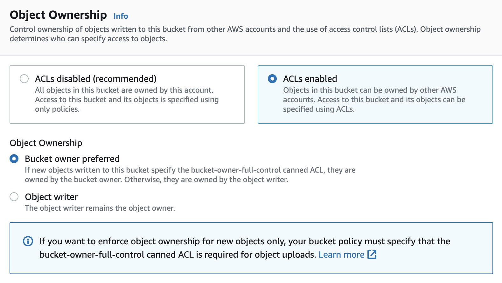
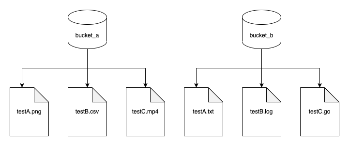
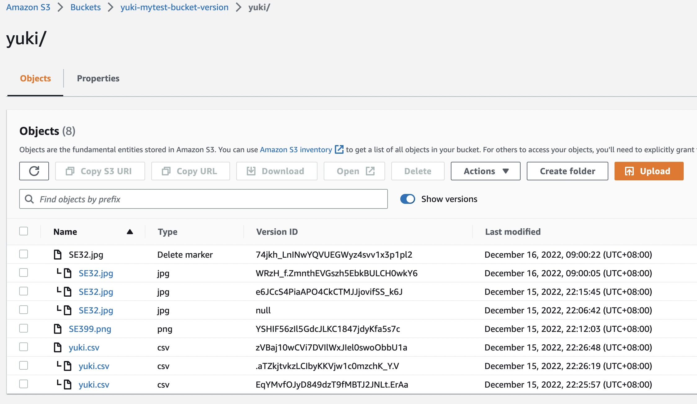

# s3 demo

## [What is Amazon S3](https://docs.aws.amazon.com/AmazonS3/latest/userguide/Welcome.html)
它是一种文件服务，上面可以存储png, jpg, csv, html等一些文件。存上去了，可以公开访问

## [怎么使用 amazon s3](https://s3.console.aws.amazon.com/s3/buckets?region=us-east-1)

### 注册账户
首先得先注册一个 aws 账户，它需要 visa 卡， 才能进行注册。注册后，可以享受 s3 的 5G 空间，可以使用12个月。


### 进入 s3


### 创建 bucket
正常创建，全部走默认流程，最终访问图片地址，会出现这样的提示，这种问题是没有打开obejct权限


### 权限设置
有三个地方需要设置权限
- object ownership (ACL)，在创建 bucket 时，需要设置启动它，它是用来控制 object 的权限的，如果未启动，object 权限栏，将会是灰色的。


- block public access setting，它是用来阻止别人来访问你的object的。如果勾选的，将会阻止除了你以外的所有人


- Access control list (ACL)，如果未设置 bucket ACL，这里将会是灰色的，不能设置，启动了ACL，就可以设置让其他人访问了。


- 设置后，再次访问，就可以看到文件了


## s3 架构

它是以一个全球唯一命名 bucket， 它的结构如下




## [AWS SDK for Go](https://docs.aws.amazon.com/zh_cn/AmazonS3/latest/userguide/UsingAWSSDK.html#sdk-general-information-section)
可以在这里阅读 aws sdk for go 的源码，可以在浏览 aws 提供的[代码示例](https://docs.aws.amazon.com/zh_cn/AmazonS3/latest/userguide/service_code_examples.html)

### [AWS SDK for go getting-started](https://aws.github.io/aws-sdk-go-v2/docs/getting-started/)

首先得注册AWS账户，然后拿到账户的 Account Keys，


Create Access Key


设置好了，可以拿到Keys。有了keys，需要设置本机的密钥环境，我这边时用 aws cli 来设置的。
1. mac 下安装 aws cli
```bash
$ curl "https://awscli.amazonaws.com/AWSCLIV2.pkg" -o "AWSCLIV2.pkg"
$ sudo installer -pkg AWSCLIV2.pkg -target /

$ which aws
$ aws --version
```

2. 设置密钥
```bash
$ aws configure       
AWS Access Key ID : xxx
AWS Secret Access Key : xxx
Default region name [None]: us-west-2
Default output format [None]: json

$ ls -al ~/.aws/
total 16
drwxr-xr-x   4 yy  staff   128 12 15 00:10 .
drwxr-x---+ 50 yy  staff  1600 12 15 00:11 ..
-rw-------   1 yy  staff    43 12 15 00:10 config
-rw-------   1 yy  staff   116 12 15 00:09 credentials
```

3. 检查是否设置成功
```zsh
$ aws s3 ls
2022-12-14 22:48:01 yuki-mytest-bucket
```

### [HelloWorld Hello S3](examples/example01_hello/main.go)
```go
package main

import (
	"context"
	"log"

	"github.com/aws/aws-sdk-go-v2/config"
	"github.com/aws/aws-sdk-go-v2/service/s3"
)

func main() {
	sdkConfig, err := config.LoadDefaultConfig(context.TODO())
	if err != nil {
		log.Fatalf("not found account key: %v", err)
	}
	s3Client := s3.NewFromConfig(sdkConfig)

	buckets, err := s3Client.ListBuckets(context.TODO(), nil)
	if err != nil {
		log.Fatalf("get bucket list err: %v", err)
	}

	for _, bucket := range buckets.Buckets {
		log.Printf("\t%v\n", *bucket.Name)
	}
}
```

```output
$ go run main.go 
Let's list up to 10 buckets for your account.
        yuki-mytest-bucket
```

## go code
### init sdk
```go
type BucketBasics struct {
	S3Client *s3.Client
}

func NewS3Client() *BucketBasics {
	sdkConfig, err := config.LoadDefaultConfig(context.TODO())
	if err != nil {
		log.Fatalf("Couldn't load default configuration. Have you set up your AWS account?, err: %v", err)
	}

	s3Client := s3.NewFromConfig(sdkConfig)
	return &BucketBasics{S3Client: s3Client}
}
```

### [bucket Example](examples/example02_bucket/bucket_test.go)
>#### create
```go
func (basics BucketBasics) CreateBucket(name string, region string) error {
	_, err := basics.S3Client.CreateBucket(context.TODO(), &s3.CreateBucketInput{
		Bucket: aws.String(name),
		CreateBucketConfiguration: &types.CreateBucketConfiguration{
			LocationConstraint: types.BucketLocationConstraint(region),
		},
	})
	if err != nil {
		log.Printf("Couldn't create bucket %v in Region %v. Here's why: %v\n",
			name, region, err)
	}
	return err
}
```

>#### QueryList
```go
func (s *S3Base) GetBucketList() ([]types.Bucket, error) {
	result, err := s.S3Client.ListBuckets(context.TODO(), &s3.ListBucketsInput{})
	var buckets []types.Bucket
	if err != nil {
		log.Printf("Couldn't list buckets for your account. Here's why: %v\n", err)
	} else {
		buckets = result.Buckets
	}
	return buckets, err
}
```

>#### IsExists
```go
func (s *S3Base) BucketExists(bucketName string) (bool, error) {
	_, err := s.S3Client.HeadBucket(context.TODO(), &s3.HeadBucketInput{
		Bucket: aws.String(bucketName),
	})
	exists := true
	if err != nil {
		var apiError smithy.APIError
		if errors.As(err, &apiError) {
			switch apiError.(type) {
			case *types.NotFound:
				log.Printf("Bucket %v is available.\n", bucketName)
				exists = false
				err = nil
			default:
				log.Printf("Either you don't have access to bucket %v or another error occurred. "+
					"Here's what happened: %v\n", bucketName, err)
			}
		}
	} else {
		log.Printf("Bucket %v exists and you already own it.", bucketName)
	}

	return exists, err
}

```

>#### delete
```go
func (s *S3Base) DeleteBucket(bucketName string) error {
	_, err := s.S3Client.DeleteBucket(context.TODO(), &s3.DeleteBucketInput{
		Bucket: aws.String(bucketName)})
	if err != nil {
		log.Printf("Couldn't delete bucket %v. Here's why: %v\n", bucketName, err)
	}
	return err
}
```


### [object Example](examples/example03_object/object_test.go)
>#### Upload and Download
```go
func (s *S3Base) UploadFile(bucketName string, objectKey string, fileName string) error {
	file, err := os.Open(fileName)
	if err != nil {
		log.Printf("Couldn't open file %v to upload. Here's why: %v\n", fileName, err)
	} else {
		defer func(file *os.File) {
			err := file.Close()
			if err != nil {
				log.Fatalf("file close err: %v", err)
			}
		}(file)

		_, err := s.S3Client.PutObject(context.TODO(), &s3.PutObjectInput{
			Bucket: aws.String(bucketName),
			Key:    aws.String(objectKey),
			Body:   file,
		})
		if err != nil {
			log.Printf("Couldn't upload file %v to %v:%v. Here's why: %v\n",
				fileName, bucketName, objectKey, err)
		}
	}
	return err
}

func (s *S3Base) UploadLargeObject(bucketName string, objectKey string, largeObject []byte) error {
	largeBuffer := bytes.NewReader(largeObject)
	var partMiBs int64 = 10
	uploader := manager.NewUploader(s.S3Client, func(u *manager.Uploader) {
		u.PartSize = partMiBs * 1024 * 1024
	})
	_, err := uploader.Upload(context.TODO(), &s3.PutObjectInput{
		Bucket: aws.String(bucketName),
		Key:    aws.String(objectKey),
		Body:   largeBuffer,
	})
	if err != nil {
		log.Printf("Couldn't upload large object to %v:%v. Here's why: %v\n",
			bucketName, objectKey, err)
	}

	return err
}

func (s *S3Base) DownloadFile(bucketName string, objectKey string, fileName string) error {
	result, err := s.S3Client.GetObject(context.TODO(), &s3.GetObjectInput{
		Bucket: aws.String(bucketName),
		Key:    aws.String(objectKey),
	})
	if err != nil {
		log.Printf("Couldn't get object %v:%v. Here's why: %v\n", bucketName, objectKey, err)
		return err
	}
	defer func(Body io.ReadCloser) {
		err := Body.Close()
		if err != nil {
			log.Fatalf("body close err: %v", err)
		}
	}(result.Body)
	file, err := os.Create(fileName)
	if err != nil {
		log.Printf("Couldn't create file %v. Here's why: %v\n", fileName, err)
		return err
	}

	defer func(file *os.File) {
		err := file.Close()
		if err != nil {
			log.Fatalf("file close err: %v", err)
		}
	}(file)

	body, err := io.ReadAll(result.Body)
	if err != nil {
		log.Printf("Couldn't read object body from %v. Here's why: %v\n", objectKey, err)
	}
	_, err = file.Write(body)
	return err
}

func (s *S3Base) DownloadLargeObject(bucketName string, objectKey string) ([]byte, error) {
	var partMiBs int64 = 10
	downloader := manager.NewDownloader(s.S3Client, func(d *manager.Downloader) {
		d.PartSize = partMiBs * 1024 * 1024
	})
	buffer := manager.NewWriteAtBuffer([]byte{})
	_, err := downloader.Download(context.TODO(), buffer, &s3.GetObjectInput{
		Bucket: aws.String(bucketName),
		Key:    aws.String(objectKey),
	})
	if err != nil {
		log.Printf("Couldn't download large object from %v:%v. Here's why: %v\n",
			bucketName, objectKey, err)
	}
	return buffer.Bytes(), err
}
```

>#### QueryList
```go
func (s *S3Base) GetObjectList(bucketName string) ([]types.Object, error) {
	result, err := s.S3Client.ListObjectsV2(context.TODO(), &s3.ListObjectsV2Input{
		Bucket: aws.String(bucketName),
	})
	var contents []types.Object
	if err != nil {
		log.Printf("Couldn't list objects in bucket %v. Here's why: %v\n", bucketName, err)
	} else {
		contents = result.Contents
	}
	return contents, err
}
```

>#### QueryInfo
```go
func (s *S3Base) GetObjectContent(bucketName, key string) (string, error) {
	output, err := s.S3Client.GetObject(context.TODO(), &s3.GetObjectInput{
		Bucket: &bucketName,
		Key:    &key,
	})
	if err != nil {
		return "", err
	}
	buf := new(bytes.Buffer)
	buf.ReadFrom(output.Body)
	return buf.String(), err
}

func (s *S3Base) GetObjectUrl(bucketName, Key string) (string, error) {
	input := &s3.GetObjectInput{
		Bucket: aws.String(bucketName),
		Key:    aws.String(Key),
	}
	psClient := s3.NewPresignClient(s.S3Client)
	resp, err := psClient.PresignGetObject(context.TODO(), input)
	if err != nil {
		return "", err
	}
	return resp.URL, err
}

func (s *S3Base) GetObjectList(bucketName string) ([]types.Object, error) {
	result, err := s.S3Client.ListObjectsV2(context.TODO(), &s3.ListObjectsV2Input{
		Bucket: aws.String(bucketName),
	})
	var contents []types.Object
	if err != nil {
		log.Printf("Couldn't list objects in bucket %v. Here's why: %v\n", bucketName, err)
	} else {
		contents = result.Contents
	}
	return contents, err
}
```

>#### Delete
```go
func (s *S3Base) DeleteObject(bucketName string, object types.Object) error {
	_, err := s.S3Client.DeleteObject(context.TODO(), &s3.DeleteObjectInput{
		Bucket: &bucketName,
		Key:    object.Key,
	})
	if err != nil {
		log.Printf("Couldn't delete objects %v from bucket %v. Here's why: %v\n", object.Key, bucketName, err)
	}
	return err
}

func (s *S3Base) DeleteObjectList(bucketName string, objectList []types.Object) error {
	var objectIds []types.ObjectIdentifier
	for _, obj := range objectList {
		objectIds = append(objectIds, types.ObjectIdentifier{Key: aws.String(*obj.Key)})
	}
	_, err := s.S3Client.DeleteObjects(context.TODO(), &s3.DeleteObjectsInput{
		Bucket: aws.String(bucketName),
		Delete: &types.Delete{Objects: objectIds},
	})
	if err != nil {
		log.Printf("Couldn't delete objects from bucket %v. Here's why: %v\n", bucketName, err)
	}
	return err
}

func (s *S3Base) DeleteObjectListByKeys(bucketName string, objectKeys []string) error {
	var objectIds []types.ObjectIdentifier
	for _, key := range objectKeys {
		objectIds = append(objectIds, types.ObjectIdentifier{Key: aws.String(key)})
	}
	_, err := s.S3Client.DeleteObjects(context.TODO(), &s3.DeleteObjectsInput{
		Bucket: aws.String(bucketName),
		Delete: &types.Delete{Objects: objectIds},
	})
	if err != nil {
		log.Printf("Couldn't delete objects from bucket %v. Here's why: %v\n", bucketName, err)
	}
	return err
}
```

### permission
>#### bucket
```go
func (s *S3Base) CreatePublicBucket(bucketName, region string) error {
	input := &s3.CreateBucketInput{
		Bucket: aws.String(bucketName),
		ACL:    types.BucketCannedACLPublicReadWrite,
		CreateBucketConfiguration: &types.CreateBucketConfiguration{
			LocationConstraint: types.BucketLocationConstraint(region),
		},
	}
	_, err := s.S3Client.CreateBucket(context.TODO(), input)
	if err != nil {
		return err
	}
	return nil
}

func (s *S3Base) PutPublicBucketAcl(bucketName string) error {
	putInput := &s3.PutBucketAclInput{
		Bucket: aws.String(bucketName),
		ACL:    types.BucketCannedACLPublicReadWrite,
	}
	_, err := s.S3Client.PutBucketVersioning(context.TODO(), putInput)
	if err != nil {
		return err
	}
	return nil
}
```

>#### object
```go
func (s *S3Base) UploadPublicFileAcl(bucketName, objectKey, fileName string) error {
	file, err := os.Open(fileName)
	if err != nil {
		log.Printf("Couldn't open file %v to upload. Here's why: %v\n", fileName, err)
	} else {
		defer func(file *os.File) {
			err := file.Close()
			if err != nil {
				log.Fatalf("file close err: %v", err)
			}
		}(file)

		_, err := s.S3Client.PutObject(context.TODO(), &s3.PutObjectInput{
			Bucket: aws.String(bucketName),
			Key:    aws.String(objectKey),
			Body:   file,
			ACL:    types.ObjectCannedACLPublicReadWrite,
		})
		if err != nil {
			log.Printf("Couldn't upload file %v to %v:%v. Here's why: %v\n",
				fileName, bucketName, objectKey, err)
		}
	}
	return err
}

func (s *S3Base) PutPublicObjectAcl(bucketName, objectKey string) error {
	input := &s3.PutObjectAclInput{
		Bucket: aws.String(bucketName),
		Key:    aws.String(objectKey),
		ACL:    types.ObjectCannedACLPublicReadWrite,
	}

	_, err := s.S3Client.PutObjectAcl(context.TODO(), input)
	if err != nil {
		return err
	}
	return nil
}

```

### object version 控制
版本控制，如其名就是利用版本控制它，它是好处，就是在删除对象的时候，不是物理删除，而是给删除打上一个标记。所以，如果用户以外的操作，把这个文件给删除了，是可以通过版本控制进行恢复的。

如果用户是覆盖这个对象，其实是给这个对象创建一个新的版本。

Bucket version status
1. 非版本化 (默认)
2. 启动版本控制 (注意:一旦启用，无法恢复，是不可逆的操作)
3. 暂停版本控制

### 启用版本控制

可以看到，启动版本控制之后，多了一个版本显示(隐藏)的按钮，点击后，可以看到版本。启动nil的版本，是以前上传的图片，所以它是没有版本的。启用版本控制之后，s3会给它增加一个32位的版本号



0. Set 需要创建bucket后，再进行设置
```go
func (s *S3Base) CreateBucketAndEnabledVersion(bucketName, region string) error {
	err := s.CreatePublicBucket(bucketName, region)
	if err != nil {
		return err
	}

	putInput := &s3.PutBucketVersioningInput{
		Bucket: &bucketName,
		VersioningConfiguration: &types.VersioningConfiguration{
			Status: types.BucketVersioningStatusEnabled,
		},
	}
	_, err = s.S3Client.PutBucketVersioning(context.TODO(), putInput)
	if err != nil {
		return err
	}
	return nil
}
```
1. Add
```go
s3Action.UploadFile(bucket, filename, key)
```
2. Recover
```go
func (s *S3Base) GetObjectVersionList(bucketName string) ([]types.ObjectVersion, error) {
	input := &s3.ListObjectVersionsInput{
		Bucket: aws.String(bucketName),
	}
	versions, err := s.S3Client.ListObjectVersions(context.TODO(), input)
	if err != nil {
		return nil, err
	}
	return versions.Versions, nil
}

func (s *S3Base) GetObjectByVersion(bucketName, objectKey, versionId string) (string, error) {
	input := &s3.GetObjectInput{
		Bucket:    &bucketName,
		Key:       &objectKey,
		VersionId: &versionId,
	}
	output, err := s.S3Client.GetObject(context.TODO(), input)
	if err != nil {
		return "", err
	}

	buf := new(bytes.Buffer)
	_, err = buf.ReadFrom(output.Body)
	if err != nil {
		return "", err
	}
	return buf.String(), err
}
```
3. Del
```go
func (s *S3Base) DeleteObjectByVersion(bucketName, objectKey, versionId string) error {
	input := &s3.DeleteObjectInput{
		Bucket:    aws.String(bucketName),
		Key:       aws.String(objectKey),
		VersionId: aws.String(versionId),
	}
	_, err := s.S3Client.DeleteObject(context.TODO(), input)
	if err != nil {
		return err
	}
	return nil
}
```


## 定价
[价格详情](https://aws.amazon.com/s3/pricing/)
[价格计算器](https://calculator.aws/#/addService)
1. 存储
	- 前 50TB/月 -> 0.023$/GB
	- 后 450TB/月 -> 0.022$/GB
	- 超过 500TB/月 -> 0.021$/GB
2. 请求
	- 1000/req -> 0.005$
3. 传输
	- 传入 aws -> 不收钱
	- aws 传出 internet 10TB/月 -> 0.09$/GB
	- aws 传出 internet 40TB/月 -> 0.85$/GB
	- aws 传出 internet 100TB/月 -> 0.07$/GB
	- aws 传出 internet 大于150TB/月 -> 0.05$/GB
4. 管理
	- 存储百万对象 -> 0.0025$
	- 监控百万对象 -> 0.1$
	- 标记1万对象 -> 0.01$
5. 复制
	- 百万对象 -> 1$
6. lambda
	- s/GB -> 0.0000167$
	- M/req -> 0.2$

## 还有什么？
- [x] [从图片中提取文本](https://docs.aws.amazon.com/zh_cn/AmazonS3/latest/userguide/example_cross_TextractComprehendDetectEntities_section.html)
- [x] [从图片中提取人脸](https://docs.aws.amazon.com/zh_cn/AmazonS3/latest/userguide/example_cross_DetectFaces_section.html)
- [x] [从图片中提取对象](https://docs.aws.amazon.com/zh_cn/AmazonS3/latest/userguide/example_cross_RekognitionPhotoAnalyzer_section.html)
- [x] [从视频中提取人物](https://docs.aws.amazon.com/zh_cn/AmazonS3/latest/userguide/example_cross_RekognitionVideoDetection_section.html)
- [x] [将文本转换为语音](https://docs.aws.amazon.com/zh_cn/AmazonS3/latest/userguide/example_cross_Telephone_section.html)